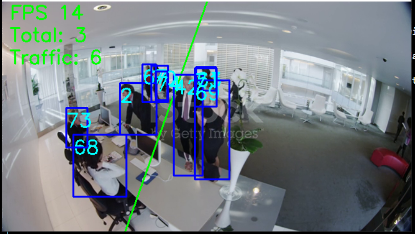

# Human Tracking System

A Human Detection and Tracking system using Simple Online and Realtime Tracking technique (SORT)
as implemented with [this paper](https://arxiv.org/abs/1703.07402). 

We intended to implement DeepSORT as in the paper, but based on performance issue 
we decide to postpone this addition. It might be good in the future. 

What makes this repository different is we only use minimal requirements and
it runs on CPU. Aside from standard deep learning libraries we barely need anything else. 

This support Python environment and pure EXE usage. User will be able to set splitting line
for counting traffic. 

# EXE file:

Available from this [Google Drive Link](https://drive.google.com/file/d/1HAPqRMHZTbuHWDxFzFmaybHXw28cpqEx/view?usp=sharing)

Should not need any dependency, just make sure have a webcam connect to your machine, unpack and run.
Tested on Windows 10 system, CPU.

# Installation

Python Version >= 3.9 should work well, only tested on Windows 10. 

Make sure installed requirements by running
```
pip install virtualenv
virtualenv venv
./venv/Scripts/activate
pip install -r requirements.txt
```
Batch files require using venv to run.

Syntax:
```
usage: sort.py [-h] [--xyxy XYXY XYXY XYXY XYXY] [--inside INSIDE INSIDE]  

Human Tracking Program

optional arguments:
  -h, --help            show this help message and exit
  --xyxy XYXY XYXY XYXY XYXY
                        [4 numbers] Two coordinates for splitting line     
  --inside INSIDE INSIDE
                        [2 numbers] One coordinate indicate inside of image
```
Note that the coordinates are normalized within range `[0,1]`.

Connect to a webcam, then run for example:
```
python sort.py --xyxy 0.5 0 0.3 1 --inside 0 0
```

# Build EXE

Before building exe, we recommend run the program by Python at least once. 
This is for Ultralytics library to AutoUpdate the `openvino` package, which 
will be used in building exe. 

For Python run quick start, make sure you have `./venv/` activated, then run `./start_bypy.bat`. 

We include the screenshot below:


## Fast Build Command (Recommended)

Make sure your virtual environment is named `./venv/`, then run the command below:

```
pyinstaller --noconfirm --onedir --console --add-data "./start.bat;." --add-data "./venv/Lib/site-packages/openvino/libs/openvino_intel_cpu_plugin.dll;./openvino/libs/" --add-data "./venv/Lib/site-packages/openvino/libs/openvino_ir_frontend.dll;./openvino/libs/" --add-data "./yolov5s_openvino_model;./yolov5s_openvino_model/" --add-data "./venv/Lib/site-packages/ultralytics/cfg;./ultralytics/cfg/" --hidden-import "detector" --hidden-import "detector.yolo" --hidden-import "tracker" --hidden-import "tracker.utils" --hidden-import "ultralytics" --hidden-import "ultralytics.yolo" --hidden-import "ultralytics.utils" --hidden-import "ultralytics.trackers" --hidden-import "ultralytics.hub" --hidden-import "ultralytics.yolo.utils"  "./sort.py"
```

The result should be in `./dist/sort/`, you can ship `./dist/sort/` directory anywhere and use it whenever you like.

Target executable is `sort.exe`. 
But normally you will use `./start.bat`. 

Feel free to edit `./start.bat` to change splitting line and side configurations. 

## Detailed Build Instructions

Make sure program can run on your computer by following Installation guide above. 
This also ensure some model files or configs are downloaded before building exe.

In virtualenv, run `auto-py-to-exe.exe`

Script Location use `sort.py`.

Add files and folders: `start_exe.bat, ./venv/Lib/site-packages/openvino/libs/openvino_ir_frontend.dll, ./venv/Lib/site-packages/openvino/libs/openvino_intel_cpu_plugin.dll, ./yolov5s_openvino_model/, ./venv/Lib/site-packages/ultralytics/cfg`. 
On the two `.dll` files, right side put `./openvino/libs/` so the dll files are stored in this subfolder.
On the last two entries, right side put `./yolov5s_openvino_model/`, `./ultralytics/cfg/`. 
Notice the dot in front.

Advanced, What to bundle, where to search, hidden_import
`detector, detector.yolo, tracker, tracker.utils, ultralytics, ultralytics.yolo,
ultralytics.utils, ultralytics.trackers, ultralytics.hub, ultralytics.yolo.utils`

You can build the exe now. 

After built, go in the directory `./output/sort/`, run `start_exe.bat` to bring up the software. 


